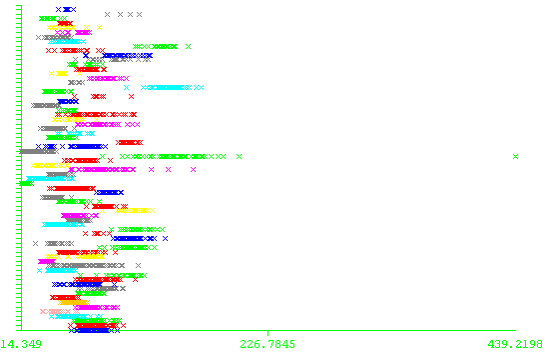

## Overview
JHalaman is a simple Java application I made for plant leaves image recognition using leaf external features in my college year. As times passed, maybe it's time to release it to public. Please do note that I provide no support and currently do not have plan to continue this project.
*Halaman (Indonesian - noun) -- yard*

## What does it do
It basically provides image preprocessing and features extraction for leaf recognition. The data I used was from [ImageCLEF 2011](http://www.imageclef.org/2011/Plants), my application had limitation that the leaves facing upward and background is uniform so I cleaned the data first.

## How well does it perform
I used Naive Bayes on the cleaned training and test data with the external features, the accuracy was 30.1887%.
Best feature was RLP or Width-Height Ratio.  

## License
MIT license [here](./LICENSE).
